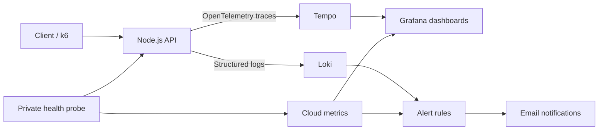

# Grafana Observability Lab

**From an API request to a diagnosed incident — with evidence at every step.**

An AI-assisted portfolio project by **Philippe Godfroy**, combining a Node.js API, OpenTelemetry, Grafana Cloud, Docker and k6. The project explores how to detect failures, locate their cause, verify recovery and measure a targeted improvement.

[Project summary · Nederlands](docs/project-summary.nl.md) · [Demo explained · Nederlands](docs/demo-guide.nl.md) · [Architecture](docs/architecture.md) · [10-minute demo](docs/walkthrough.md) · [CI results](https://github.com/phlppgdfry/grafana-observability-lab/actions/workflows/ci.yml)

## The problem

A successful healthcheck does not tell you why an individual request is slow or failing. This lab connects external availability checks with request logs and traces, so an issue can be followed from an alert to the processing step that caused it.

The API accepts a document name and simulates processing. **The HTTP traffic and telemetry are real; document storage and extraction are not implemented.**

## Results at a glance

| Result | What was verified | Evidence |
| --- | --- | --- |
| Request-level diagnosis | One HTTP request linked to its log and five trace spans | [Trace/log verification](docs/evidence/day-14-check.json) |
| Alerting and recovery | Injected latency and HTTP 500 errors triggered alerts; both rules recovered | [Incident exercise](docs/day-10.md) |
| Bounded load testing | 1,000 requests/s for 20 seconds, with no unexpected HTTP errors or dropped iterations | [Load profile and results](docs/day-09.md) |
| Measured improvement | Remaining processing after client disconnect fell from **29.73 ms to 1.04 ms** on average | [Before/after comparison](docs/day-11.md) |
| Repeatable delivery | CI tests the API and starts the Docker setup twice from a clean checkout | [GitHub Actions workflow](.github/workflows/ci.yml) |
| Usage awareness | A command checks Cloud usage against documented Free-tier budgets; local logs have rotation limits | [Budget decisions](docs/day-13.md) |

These are measurements from a local lab. The load test did not establish maximum or sustained production capacity. The cancellation improvement reduces abandoned work; normal request processing remained approximately as fast as before.

## See the system working


*Recorded on 15 September 2026. The 32% HTTP error figure comes from deliberately invalid test inputs; the dashboard shows zero 5xx server errors. This screenshot combines a functional check and demo traffic, not a performance benchmark.*

[Availability screenshot and final verification](docs/day-14.md) · [Guided demonstration](docs/walkthrough.md)

The screenshots and saved evidence can be reviewed without a Grafana login. The live Grafana stack requires account access and a running local lab. This repository is public; the live Grafana account and local API remain separate from repository access.

## What the project demonstrates

| Area | Implementation |
| --- | --- |
| Backend engineering | Input validation, bounded request bodies, sanitized errors and cancellation of abandoned processing |
| Observability | OpenTelemetry instrumentation, structured logs, trace correlation and Grafana dashboards |
| Troubleshooting | Controlled failure injection, identification of the affected processing span and verified recovery |
| Testing | HTTP contract checks, negative cases, cancellation tests and k6 scenarios with explicit thresholds |
| Delivery and operations | Docker Compose, pinned image digests, dependency lockfile, CI artifacts and repeatable setup commands |
| Technical communication | Architecture, runbooks, measured results and clearly stated limitations |

The repository provides practical discussion material for junior backend, DevOps and cloud operations interviews. Detailed experiment notes and runbooks are in Dutch; commands, source code and raw measurements are directly available for review.

## Architecture



The API dashboard derives request metrics from traces. Alert rules use probe metrics and request logs. Healthchecks are excluded from application traces and logs to avoid duplicate telemetry.

[Architecture and design boundaries](docs/architecture.md) · [Application code](app/) · [Telemetry code](telemetry/)

## Try it locally — no Grafana account required

Requires **Node.js 22+**. CI and Docker use Node.js 24.

```sh
git clone https://github.com/phlppgdfry/grafana-observability-lab.git
cd grafana-observability-lab
npm ci
npm start
```

In a second terminal:

```sh
npm run check:flow
npm test
curl -X POST http://127.0.0.1:4310/api/documents/process \
  -H 'Content-Type: application/json' \
  -d '{"name":"demo.pdf"}'
```

Alternatively, with Docker running and port 4310 free:

```sh
npm ci
npm run lab:up -- --local
npm run lab:stop -- --local
```

Cloud mode requires the existing Grafana context and local credentials. Follow the [setup runbook](docs/setup.md), then run `npm run lab:up`. Do not run local Node and Docker versions on the same port simultaneously.

## Explore the evidence

| Start here | Contents |
| --- | --- |
| [Dutch project summary](docs/project-summary.nl.md) | Plain-language overview, interview discussion and CV wording |
| [Demonstration](docs/walkthrough.md) | A short walkthrough from request to trace and diagnosis |
| [Final report](docs/day-14.md) | Screenshots and the final verification snapshot |
| [Setup](docs/setup.md) | Requirements, commands and troubleshooting |
| [Alert runbook](alerts/README.md) | Rules, notification behavior and response steps |
| [14-step learning log](docs/roadmap.md) | Complete development history and experiment reports |
| [Raw evidence](docs/evidence/) | Saved JSON measurements and verification results |

## Scope and authorship

This is an **AI-assisted learning and portfolio project developed with Codex**. AI contributed implementation, testing and documentation. The repository preserves reproducible commands and measured outcomes so the work can be inspected and discussed beyond the generated code.

It is a single-machine lab with simulated document processing. Authentication, persistent storage, real PDF extraction, high availability and production deployment are outside its current scope. Future integrations must support cancellation themselves; an abort signal does not undo completed side effects.

All fourteen planned work stages are complete. Ongoing maintenance and account checks are tracked in the [project status](docs/status.md). Credentials remain outside Git. Historical screenshots are evidence from their capture date, not a live availability guarantee.
