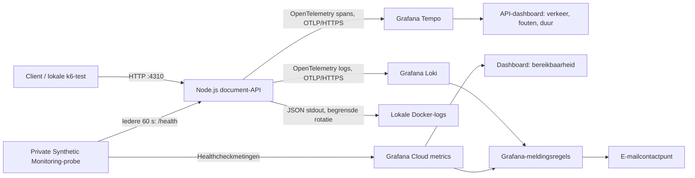
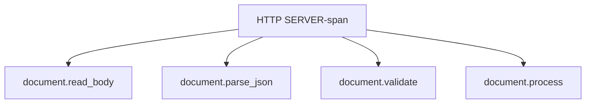

# Architectuur van het lab

## Van aanvraag naar inzicht

De API en probe draaien op dezelfde Mac in Docker. Alleen de API-poort is op `127.0.0.1:4310` beschikbaar; de probe gebruikt intern de alias `document-lab.test`. Traces, logs en metingen gaan naar de bestaande Grafana Cloud-stack. Er draait geen lokale collector, Loki-, Tempo- of Prometheus-server.

## Wat doet de API?

`POST /api/documents/process` ontvangt JSON met een documentnaam. Hij leest maximaal 16 KiB, ontleedt JSON, valideert de naam en simuleert circa 40 ms verwerking. Een geslaagde aanvraag krijgt een unieke document-ID en request-ID. Er wordt geen document geüpload of opgeslagen.

De vier interne stappen worden na elkaar uitgevoerd en hebben dezelfde HTTP-span als parent. Hun trace-ID koppelt ze aan de requestlog. De response geeft `x-trace-id` en `x-request-id` terug. `/health` krijgt bewust geen applicatietraces of requestlogs: die route heeft al een eigen probe.

Bij ongeldige invoer volgt 400 of 413, bij een onbekende route 404 en bij een onverwachte interne fout een gesaneerde 500. Bij clientdisconnect annuleert de server de verwerkingsfunctie via een `AbortSignal`; daarvoor moet die functie het signaal respecteren. De standaardtimer doet dat. De oorspronkelijke exceptiontekst, body en documentnaam worden niet geëxporteerd.

## Hoe ontstaan de dashboards en meldingen?

| Vraag | Gegevensbron | Interpretatie |
| --- | --- | --- |
| Is de API bereikbaar? | Probe-metrics | Werkt alleen terwijl de Mac en probe actief zijn |
| Hoeveel aanvragen, fouten en latency? | Tempo via TraceQL metrics | Telt SERVER-spans, geen interne stappen |
| Welke aanvraag faalde? | Gestructureerde Loki-log | Request-ID, route, status, duur, trace-ID |
| Waar zit de oorzaak? | Tempo-spans | Afzonderlijke fasen en hun duur/foutstatus |
| Moet er een melding komen? | Prometheus-/Loki-queries | Uitval, 5xx en trage succesvolle verwerking |

Er zijn geen afzonderlijk geëxporteerde applicatiemetrics. De API-dashboardcijfers worden afgeleid van traces. Het lab bewaart daarom alle nieuwe roottraces en alle requestlogs, met behoud van de samplingkeuze van een binnenkomende parent. Geheugenbuffers en netwerkuitval kunnen alsnog afleververlies geven; een response met trace-ID bewijst op zichzelf geen ontvangst in Grafana.

## Herhaalbaarheid en beheer

- `scripts/lab.mjs`: preflight, Compose-start/stop, gebruikersflow, trace/log-verificatie en toepassen van vaste manifests.
- `dashboards/` en `alerts/rules/`: gewenste configuratie met vaste IDs.
- GitHub Actions: Node-tests, echte HTTP-flow en tweemaal Docker-start vanaf een schone checkout zonder Cloud-credentials.
- `tests/` en `experiments/`: begrensde belasting- en foutoefeningen; geen permanente loadgenerator.
- `.local/`: uitsluitend lokale credentials; niet in Git of Docker-buildcontext. De Cloud-token wordt als read-only secret gemount.
- `docs/evidence/`: geselecteerd controlebewijs; `test-results/`: nieuwe uitvoeringsrapporten buiten Git.

De Docker-images hebben vaste digests en npm gebruikt de lockfile. Cloud-onboarding en het e-mailcontactpunt zijn bestaande vereisten; de workflow maakt geen nieuwe organisatie of abonnement aan. Zie [setup](setup.md), [meldingsrunbook](../alerts/README.md) en [Free-budget](day-13.md).

## Grenzen van het resultaat

Dit is een aantoonbaar werkend lokaal observability-lab. Het is geen productieomgeving met authenticatie, duurzame documentopslag, back-ups, meerdere API-instances of een bewezen maximale capaciteit. Een slapende Mac onderbreekt de lokale dienstverlening. De bewaartermijn in Grafana is eindig; historische screenshots en bewijsbestanden in Git blijven bruikbaar.
