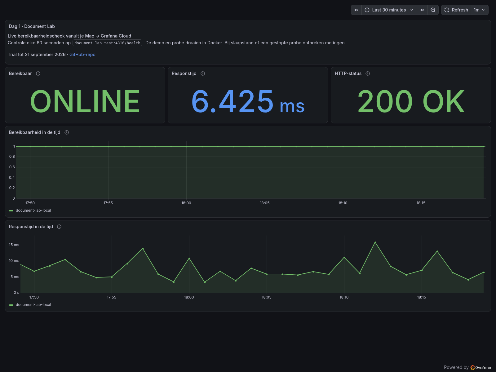
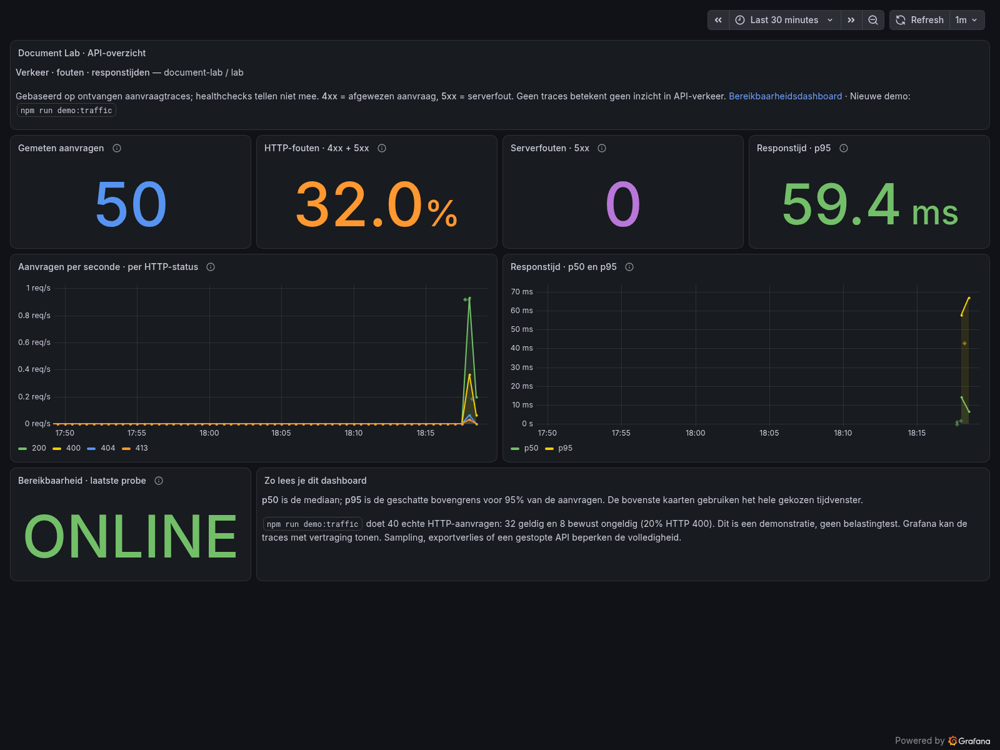

# Dag 14 — eindresultaat

Afgerond op 15 september 2026. De veertien dagen zijn werkstappen; ze zijn binnen de trial uitgevoerd.

## Wat kun je laten zien?

Een lokale Node.js-API met echte HTTP-aanvragen, OpenTelemetry-traces, gestructureerde logs, Grafana-dashboards en geteste waarschuwingen. Daarbovenop: automatische functionele controles, begrensde belastingtests, herhaalbare foutinjectie, een gemeten verbetering en een herhaalbare setup.

Begin bij de [demonstratie van tien minuten](walkthrough.md) en het [architectuuroverzicht](architecture.md). Gebruik [setup](setup.md) om het lab opnieuw te starten. De afzonderlijke [dagverslagen](roadmap.md) bevatten het historische meetbewijs.

## Actuele screenshots

Beide screenshots zijn op 15 september 2026 rond 18:19 UTC vanuit de bestaande Grafana-dashboards gerenderd, op 1600 pixels breed, met het afgelopen halfuur als tijdvenster. Ze zijn visueel gecontroleerd: de panels tonen data, de teksten zijn leesbaar en er staan geen datasourcefouten in beeld.

### Bereikbaarheid

De laatste probe toont ONLINE, HTTP 200 en 6,425 ms. De getoonde meetpunten in het halfuur zijn geslaagd. Dit is een momentopname vanuit de lokale probe, geen langdurige beschikbaarheidsgarantie.

### API-overzicht

Het dashboard toont 50 aanvragen, 32% HTTP 4xx/5xx, nul 5xx en p95 59,4 ms. Dat past bij tien niet-health-aanvragen uit de gebruikersflow plus veertig demo-aanvragen: acht verwachte afwijzingen in de flow en acht in de demo. De hoge afwijzingsfractie is dus bewust testgedrag. De demo alleen heeft 20% afwijzingen. Dit gemengde dashboardvenster is geen nieuwe k6-nulmeting.

## Belangrijkste bewezen resultaten

| Onderdeel | Aantoonbaar resultaat | Bewijs |
| --- | --- | --- |
| Observability | Echte aanvraag gekoppeld aan vijf spans en één requestlog | [Dag 5](day-05.md), [eindcontrole](evidence/day-14-check.json) |
| Belastbaarheid | Tot 1.000 aanvragen/s gedurende 20 s, geen grens gevonden binnen die test | [Dag 9](day-09.md) |
| Diagnose | Vertraging en interne fout teruggevonden in verwerking; regels geactiveerd en hersteld | [Dag 10](day-10.md) |
| Verbetering | Resterende verwerking na disconnect: 29,73 → 1,04 ms gemiddeld | [Dag 11](day-11.md) |
| Herhaalbaarheid | Tweemaal Cloud-start/toepassing en Docker-setup vanaf schone checkout | [Dag 12](day-12.md) |
| Beheer | Free-budgetcontrole, expliciete samplingkeuze, begrensde lokale logs | [Dag 13](day-13.md) |

De eindcontrole heeft de twaalf HTTP-stappen en verse trace/log-aflevering geverifieerd. Daarna zijn [40 demo-aanvragen](evidence/day-14-demo-traffic.json) uitgevoerd: 32 geldige en 8 verwachte afwijzingen. Er zijn voor deze presentatie geen nieuwe 5xx-fouten of alertoefeningen geïnjecteerd.

Alle drie meldingsregels waren bij de [laatste controle](evidence/day-14-final-state.json) gezond en inactief. De [verse gebruikscontrole](evidence/day-14-usage.json) gaf `pass` voor alle vijf vastgelegde budgetten. De lokale links in de einddocumentatie zijn gecontroleerd.

## Wat moet je kunnen uitleggen?

- Het verschil tussen metrics (hoeveel/hoe vaak), logs (wat gebeurde er) en traces (waar in de aanvraag).
- Waarom HTTP 400 een invoerafwijzing is en HTTP 500 een interne fout.
- Waarom een snelle fout geen goede gebruikerservaring is, en gemiddelde duur iets anders betekent dan p95.
- Hoe een trace-ID dezelfde aanvraag verbindt tussen antwoord, spans en log.
- Waarom een alert pas na een wachttijd verschijnt en na herstel nog even actief kan blijven.
- Waarom een eerlijke verbetering een vergelijkbare voor/na-meting nodig heeft.
- Waarom een draaiende container nog geen bewijs is van geslaagde telemetrie-aflevering.

## Na de trial

De trial-einddatum blijft **21 september 2026**. Controleer dan het daadwerkelijke accountplan en voer `npm run lab:usage` opnieuw uit. Er is geen toekomstige controle ingepland en geen betaald abonnement geactiveerd. De Free-budgetten zijn op dag 13 gecontroleerd; historische gegevens kunnen na de retentieperiode verdwijnen. De bewijsbestanden en screenshots in Git blijven bestaan.

Alle roadmapstappen zijn uitgevoerd, maar onderhoud blijft nodig: dependency-updates, periodieke gebruikscontrole, credentials beheren en Docker actief houden wanneer je de probe wilt laten meten. Voor productie ontbreken onder andere echte documentverwerking en opslag, authenticatie, schaalbaarheid en herstelprocedures voor duurzame data. Kies zo'n uitbreiding als een nieuw projectdoel met eigen eisen en tests.
